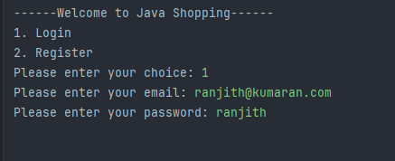
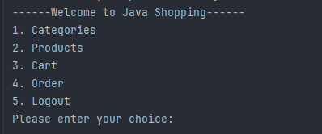
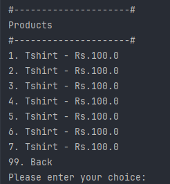
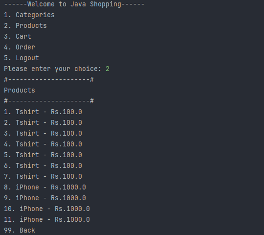
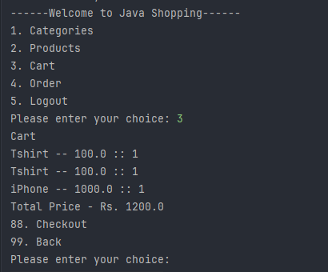
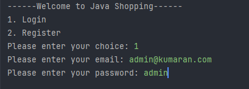
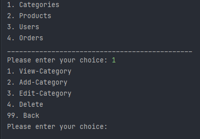
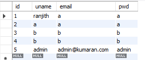
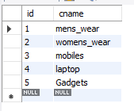
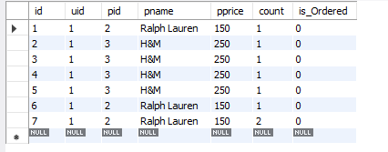

 

# E-commerce using Java with JDBC Connection (MYSQL).

The Project is developed using the Java version-v.17 and mysql version-v.8

like other e-commerce , the user can able to register and login and buy products and it will be added to the cart the in cart the user can checkout the products.

    

## Features

 - Register and login
 - View products by category 
 - View products
 - Add to cart
 - Orders
 - Admin
    - CRUD operation in categories 
    - CRUD operation in products 
    - View Registered Users
    - View Orders of the Users
 - Used Mysql Database to store:
    - Users
    - products
    - categories
    - AddToCart 
    - Orders

## Roadmap

- First created all basic and the required utils , intefaces, classes and controllers(class) for the specific class. 
- then done the authentication part, the user has to register with certain details and login with the same. during this process, i have to store the user to check or to retrieve the user credential to login again.

- After login , the products should be loaded in the page. for that: products are read from the database and shown to the user. it is same to the categories.

- 4 Menu options will be shown to the user:
    - Category
    - products
    - Cart 
    - Order
    Then Choosing the option will show the respective details to user.

    when the user doesn't added anything to cart, then it will show empty. else if the user has added some products to cart it will be saved in the database and get from the db and shown to the user.
- while reading the products from while by category, i have faced an issue that the category in products can't be accessed. so to rectify this, i get the category from the db and then added the products to that category. if the category is not available the product will not be added.
- then i have faced issue on addtocart file:
    
    when the user loggedout and cameback his/her products should be in the cart. so i have created a table to show the cartproducts to user when they are loggedin and a csv file when they cameback and view the cart.

- then the admin part:

    The Admin can do the CRUD-Operation with the categories table & Products table.

    Admin can also view the registered user.

    Admin can also view the Orders of the specific user.

## Screenshots
- login: 

- HomeMenu:

- Category & products:

- All Products:

- Cart Page:

- ADMIN: 

  - login

  

  - MenuCategory
  
  

- Databases:

    - Users:
  
    
  
    - Categories:
  
    
    
    - Cart:
  
    
